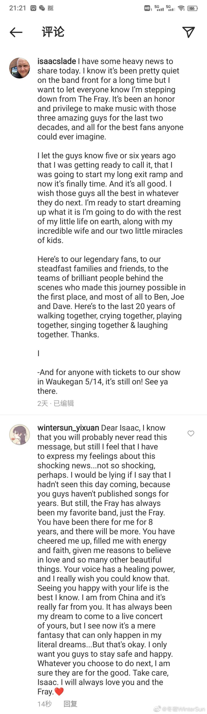
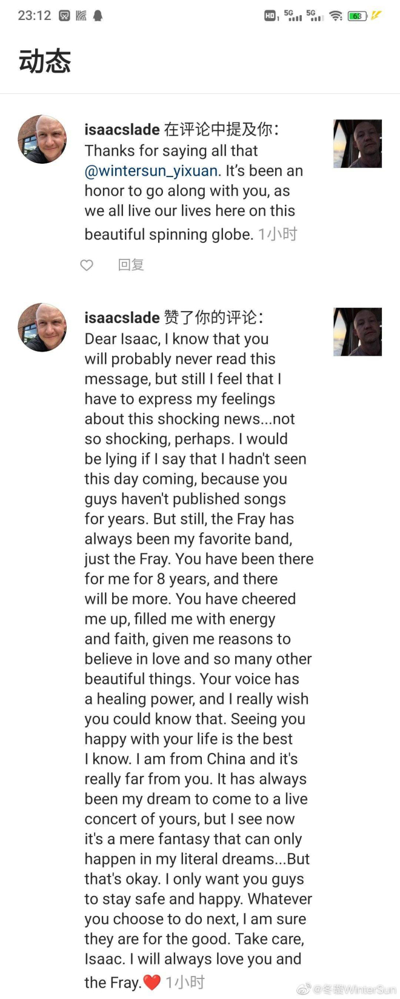

---
layout: post
title: "故事终结之处"
date: 2023-06-20
image: where-the-story-ends.jpg
tags: [daily, 中文, English]
categories: Daily
summary: "故事终结之处，新的开始也在徐徐展开。我所爱的，从未离开。"
---    

**我以这首歌的名字作为这篇文章的标题。这篇文章，郑重地献给The Fray陪我走过的十载春秋。**

```    
Where the Story Ends 故事终结之处
Artist: The Fray
翻译：冬璇

Trying not to lose my head, but I have never been this scared before 我竭尽全力不让自己崩溃，可我从未感到如此恐惧
Tell you what I'll do instead, lay my body down on the floor 为了缓解恐惧，我将躺在地上
To forget what I've done, silhouette 'til the good Lord come 清空脑袋，忘掉自己的所作所为，像一具剪影等待救世主到来

All we know is distance 我们感知的唯有距离
We're close and then we run 我们亲密无间，而后各自奔走
Kiss away the difference 以亲吻，来消弭分歧
I know you hate this one 我明白，这是你所怨恨的

Trying not to lose your own 你用尽力气保持理智
Boxing up everything you've got 将你的物件一一打包
All you ever knew of home 你记忆中的家的模样
You're scared, scared to see your mother there in the door 你无比、无比害怕会看见自己的母亲站在门口等你回家
You wonder "Where did the years go?" 你不禁思索“这些年岁都去了哪里？”

All we know is distance 我们能感知的唯有距离
We're close and then we run 亲密无间的我们如今各自奔逃
Kiss away the difference 亲吻能消弭分歧
I know you hate this one 可我知道，这是你所厌恶的
But this is how the story ends 可这便是故事终结之处
Or have we just begun? 又或者，一切才刚开始？
To kiss away the difference 只需一吻，即可消弭所有分歧
I know you hate this one 可我明白，这是你所怨恨的

The violins make no sounds 小提琴喑哑无声
And I begin to feel the ground 我终于有了知觉，身下地板冰凉

All we know is distance 我们感知的唯有距离
We're close and then we run 我们亲密无间，而后各自奔走
Kiss away the difference 以亲吻，来消弭分歧
I know you hate this one 我明白，这是你所怨恨的
But this is where the story ends 可这便是故事终结之处
Or have we just begun? 又或者，一切才刚开始？
To kiss away the difference 我们以亲吻消弭分歧
I know you hate this one 我明白，这是你所怨恨的 
```


我最近迷上逃跑计划。独处时、上班途中、和人聚会……我总想反反复复聆听他们仅有的两张录音室专辑。但今早出门时，我脑海中突然回荡“Little House”的旋律“Something is scratching. It's a way out. Something you want to forget about”，于是我打开Apple Music的我的资料库，想听How to Save a Life时才发现，我甚至没在Apple Music里收藏它。遂添加至资料库，从头开始播放。    
如果我在这里大肆谈论重听The Fray给我多么强烈的震撼，那我确凿无疑是在撒谎。事实是，一路上，从家到公司的地铁站，耳机里Isaac的声音成了最完美的背景音乐——从不喧宾夺主，感官上的认知接近于无。就像当你完全熟悉了一样事物，它的一切动向皆了然于胸，给你最充足安全感的同时，它也失去全部存在感。    
我和The Fray，自2012年偶遇之后，我于2014年沉醉于他们，至今2023年，也有十年了。别人有自己年少时的一腔欢喜，而他们于我而言，就是我的欢喜。那时候总觉得有很多话想对他们说，但大多只是悄悄融入在其他的事项中——语文周记的字里行间、文具盒上给自己写的激励贴、QQ个性签名的歌词……如此久了，我都没有认认真真地为他们写过一篇专为他们的文章，来表达我有多爱他们，可他们已经不是曾经的模样了。    
我有逃避现实的毛病，当发生让我不愿接受或难以理解的事情，我表面接受、从容应对，之后就将其束之高阁，让自己不受其所扰。Isaac离开乐队这件事情，对我而言就是其中最为重大的一项。    
那是去年3月。我翻看了微博，看见那时自己十分体面且富含意义地为自己的执念做了了结。我把Isaac的帖子、我的回复及他的回应都附在下面（它们均来自我当时的微博）：    

<br/>
    
    
<br/>

我又读了一遍，看见的满是真诚与不舍，更重要的是豁达。我说，我一直梦想着有天能去看他们的演唱会，而今这真成了一个梦中才能实现的事情。然后我马上补充道：不过没关系的。
但真的没关系吗？我没允许自己深入去想。我很擅长在自己尚未察觉到深入思考某件事情能带来多大痛苦的时候，禁止自己去感受。迅速遗忘，然后继续自己其他方面的生活，就当这件事情从未发生过。    
自那以后，“Isaac离开The Fray”这件事，在我脑海里仅是一个冰冷的概念。我知道这件事，就像我知道牛顿第三定律是作用力与反作用力一样，客观、无从辩驳，且不激起我的丝毫主观情绪。我依旧听The Fray的歌，依旧关注他们的社交网络，就像我依旧正常地过着我自己的生活。     
可是就在今天上午，列车停靠在站台，我走向扶梯，耳机里播放How to Save a Life的最后一首“Trust Me”：“We are only taking turns holding this world. When you are older, you will understand.”就在那一瞬，像被一道闪电击中，我突然参透“Isaac离开The Fray”这件事于我而言意味着什么：    
意味着Isaac再也不会用他那让我熟悉到落泪的嗓音，唱这些我烂熟于心的歌了。    
意味着即便有天我真的能去The Fray的演唱会，我也不会见到Isaac，这个曾经让我魂牵梦萦的男人。    
意味着曾经陪我走过无数日夜、十载春秋的四人乐队，曾经我以为无可拆散的他们，已经不再完整。    
意味着……我的一部分精神支柱，早已坍塌，只是我现在才察觉它的残垣断壁。    
我知道自己必须为他们写点什么，即使不那么美丽。    
但令人惊讶的是，我真正想写的不是伤感，而是庆幸与感谢。我的确伤感，就像和一位老朋友作别。    
可我却觉得自己无比幸运，因为我意识到，失去我曾经的The Fray也未能将我击垮。The Fray曾经是我最大的精神支柱，是我最想珍藏的一切。对于那样的我而言，若经历了这样的剧变，怕是会直接失去信念。    
假如是2016年的我，面临高三的压力和紧张情绪，唯一让我觉得希望与心安的，就是知道他们在环绕美国巡演，就是按照日期对照他们的巡演时间安排，想象着四个人在不同地方的模样。    
我还记得，晚自习的课间，去楼下的卫生间时，门口的小径通向黑夜，远处某棵树下，我时常看见Isaac的身影——高大挺拔、一脸笑意，好像一直都等在那里，只为在这短短十分钟里，与我相聚。    
我从不羡慕别人有恋爱可谈，因为在我心里，我和我喜欢的人随时都能在一起。    
“我喜欢的人，身高一米九二，唱歌非常好听，是我见过最温柔最可靠的人。”    
——我喜欢的人，是Isaac Slade。就像喜欢一个让我心动的人，那种眷恋和向往。    
可是后来，我也有了新的寄托，繁杂、易变，走马灯一般掠过我的世界，很多的，自从离开就再没被我记起。    
我不再痴心于Isaac，而是将The Fray作为我喜欢的众多艺人中的一个。我会说，我最喜欢的是The Fray。我会在需要设置密码的时候，本能地想起他们的生日，然后随机选一个进行变换。    
但是我不再看见Isaac，不再于某棵树下看见他的身影，或者深夜里想着他入眠。    
The Fray就此融入我平淡的生活里，静悄悄地陪伴我，和其他我所喜爱的事物别无二致。    
但即便这样，倘若Isaac的离去再早一点，我的境况也会比现在糟糕一些。    
毕竟，曾经的我是那么孤独，能让我觉得安心的，无非就是我所爱的种种。如果失去了我最爱的，那打击也会是空前的。     
更令人心碎的是，我决定不了这样的改变是否发生。就像Isaac的离开一样。    
但我的幸运是，2021年末，我遇见了Jack。他继承了我曾经对他人的全部爱恋和渴念，更重要的是，他真正属于我。他给我的怀抱不止存在于我脑海，他等待的身影可以为世界所看见。    
而Isaac选择在这之后离开，于我而言，何尝不是一种幸运？仿佛是一个历史阶段落下帷幕，而新的继任者展开全新的篇章。    
The Fray曾经给我无数信念，即便是我最黑暗的日子里，他们也高举着手中的火把，为我引路。我总说，我无比幸运，熬过如此之多的艰辛，却依然等到他的出现，然后张开双臂，将他揽入怀中。    
当我回首，那些陪过我的事物，纵使白云苍狗，回忆也永远闪光。    
于是呼应了这篇文章的标题：    

_All we know is distance 我们感知的唯有距离    
We're close and then we run 我们亲密无间，而后各自奔走    
Kiss away the difference 以亲吻，来消弭分歧    
I know you hate this one 我明白，这是你所怨恨的     
But this is where the story ends 可这便是故事终结之处     
Or have we just begun? 又或者，一切才刚开始？    
To kiss away the difference 我们以亲吻消弭分歧    
I know you hate this one 我明白，这是你所怨恨的_

故事终结之处，新的开始也在徐徐展开。    
我所爱的，从未离开。    

<br/>
# 小记 / Notes

<br/>
——Winter Sun   
10-18-2023     
Shanghai, China

<br/>
_Picture: Created with Wombo_